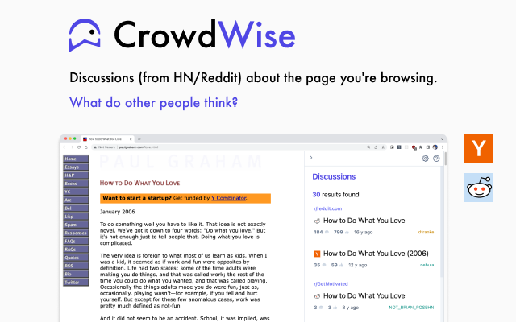

# CrowdWise

  

  

# What's CrowdWise?

CrowdWise is a Google Chrome extension that adds to your browsing experience by showing you relevant discussions about your current web page from Hacker News and Reddit.

  

## Features

### Discussions on Hacker News and Reddit

- When you navigate to a web page, CrowdWise pulls relevant discussions about this web page from Hacker News and Reddit. You can click on these discussions and it will - open in a new tab, where you can find counter-opinions and different perspectives.

### Incognito Mode

By default, CrowdWise searches for relevant discussions in the background. For additional privacy, CrowdWise also includes an Incognito mode where it will only search for discussions when you click on the CrowdWise button.

### Personalised Settings

Adjust the sidebar to suit the look and feel that you like. You can customise the following:

- Keyboard shortcuts to open and close the sidebar
- Font sizes
- Sidebar width
- and more

## Setup

### Running this project

- `npm install`
- `npm start`
- For chrome: go to `chrome://extensions/` and `Load unpacked`, point it to the `build/` folder.

## Credits

- Some HN and Reddit parsing code adapted from Newsit: https://github.com/benwinding/newsit/
- Michael Xieyang Liu: [Website](https://lxieyang.github.io)
  - This boilerplate is largely derived from [lxieyang/vertical-tabs-chrome-extension](https://github.com/lxieyang/vertical-tabs-chrome-extension) and [lxieyang/chrome-extension-boilerplate-react](https://github.com/lxieyang/chrome-extension-boilerplate-react) (which in turn is adapted from [samuelsimoes/chrome-extension-webpack-boilerplate](https://github.com/samuelsimoes/chrome-extension-webpack-boilerplate)).
